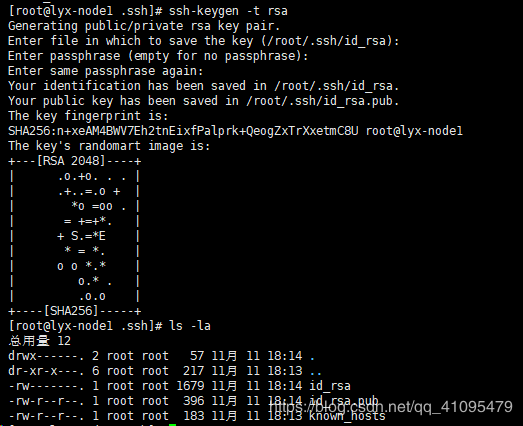
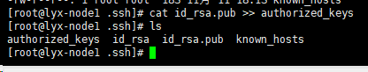
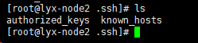
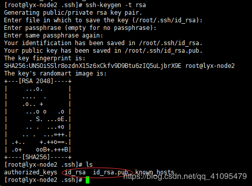
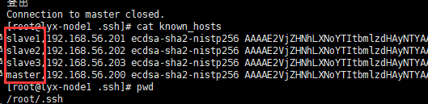
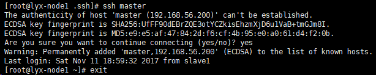
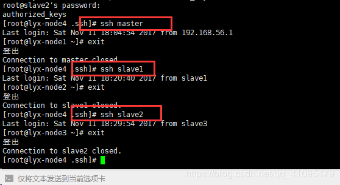

# 1 配置思路
通过RSA加密算生成了密钥，包括私钥和公钥，我们把公钥追加到用来认证授权的key中去。
每台机器配置本地免密登录，然后将其余每台机器生成的~/.ssh/id_dsa.pub公钥内容追加到其中一台主机的authorized_keys中，然后将这台机器中包括每台机器公钥的authorized_keys文件发送到集群中所有的服务器。这样集群中每台服务器都拥有所有服务器的公钥，这样集群间任意两台机器都可以实现免密登录了。
配置四台虚拟机
主机： master
从机： slave1
从机： slave2
从机： slave3
这四台虚拟机可以在VMware中配置好一台后进行复制，本篇所采用的的机器已经配置完jdk
注：如果机器配置不够，仅仅为了学习的话可以不用配置那么多虚拟机

# 2  第一台机器(master)的配置 
## 注意留意命令所处的文件夹！！要不然容易出错。（.ssh目录）
### 2.1 生成公钥和密钥
```javascript
// 生成公钥和密钥
ssh-keygen -t rsa
```

### 2.2 把公钥文件放入授权文件中
```javascript
// 把公钥文件放入授权文件中
cat id_rsa.pub >> authorized_keys
```

### 2.3 写入认证文件
```javascript
// 写入认证文件
scp ~/.ssh/authorized_keys slave1:~/.ssh/
```
**注意这里写的是slave1不是主机名master**
如果是在slave1这个节点为初始状态时（未进行任何的ssh操作之前，根目录下没有.ssh目录）此时需要手动在slave1节点上，进行一次ssh操作，如：ssh slave1
**然后再执行这个命令会得到**

## 3 第二台机器(node1)
### 3.1写入公钥和密钥
```javascript
ssh-keygen -t rsa
```


### 3.2  同上设置

```javascript
cat id_rsa.pub >> authorized_keys
scp ~/.ssh/authorized_keys slave2:~/.ssh/
```
**此时可能会出现同上问题**

## 4 第三台机器(node2)

```javascript
//同样的设置 也会出现相同的问题 就会有相同的解决方法 此时你应该能熟练的解决这个问题了
ssh-keygen -t rsa
cat id_rsa.pub >> authorized_keys
scp ~/.ssh/authorized_keys slave3:~/.ssh/
```

## 5 第四台机器(node3)

```javascript
ssh-keygen -t rsa
cat id_rsa.pub >> authorized_keys

scp ~/.ssh/authorized_keys master:~/.ssh/
scp ~/.ssh/authorized_keys slave1:~/.ssh/
scp ~/.ssh/authorized_keys slave2:~/.ssh/

```
## 6 免密检查

```javascript
//注意自己当前所处的目录在哪
cat /.ssh/known_hosts
```

**如果没有的话，比如master没有，则需要在该机器上重新执行一下ssh master命令，让其生成以上信息即可。**

## 7 在node4中测试连接

## 8 可能出现的问题
 **8.1 如果# ssh master出现ssh: Could not resolve hostname ./id_rsa: Name or service not known**

```javascript
//检查能否ping从机的IP地址
ping 192.168.56.202
```
如果能ping通说明配置是没问题的

```javascript
vi /etc/hosts
```
在hosts文件中加入IP地址和主机名，实现两者的映射关系

```
127.0.0.1   localhost localhost.localdomain localhost4 localhost4.localdomain4
::1         localhost localhost.localdomain localhost6 localhost6.localdomain6
192.168.56.202 slave2
```


**8.2 如果用ssh时 提示WARNING: POSSIBLE DNS SPOOFING DETECTED**

```
@@@@@@@@@@@@@@@@@@@@@@@@@@@@@@@@@@@@@@@@@@@@@@@@@@@@@@@@@@@
@       WARNING: POSSIBLE DNS SPOOFING DETECTED!          @
@@@@@@@@@@@@@@@@@@@@@@@@@@@@@@@@@@@@@@@@@@@@@@@@@@@@@@@@@@@
The RSA host key for www.163.net has changed,
and the key for the according IP address 158.252.167.117
is unknown. This could either mean that
DNS SPOOFING is happening or the IP address for the host
and its host key have changed at the same time.
@@@@@@@@@@@@@@@@@@@@@@@@@@@@@@@@@@@@@@@@@@@@@@@@@@@@@@@@@@@
@    WARNING: REMOTE HOST IDENTIFICATION HAS CHANGED!     @
@@@@@@@@@@@@@@@@@@@@@@@@@@@@@@@@@@@@@@@@@@@@@@@@@@@@@@@@@@@
IT IS POSSIBLE THAT SOMEONE IS DOING SOMETHING NASTY!
Someone could be eavesdropping on you right now (man-in-the-middle attack)!
It is also possible that the RSA host key has just been changed.
The fingerprint for the RSA key sent by the remote host is
11:8e:a8:b4:91:95:8b:15:82:b8:71:de:a7:c1:c0:aa.
Please contact your system administrator.
Add correct host key in /home/fuck/.ssh/known_hosts to get rid of this message.
Offending key in /home/fuck/.ssh/known_hosts:1
RSA host key for www.163.net has changed and you have requested strict checking.
Host key verification failed.
```

找到.ssh文件里的known_hosts文件

```javascript
//在.ssh目录下执行删除操作然后再ssh即可
rm known_hosts
```
**8.3 各虚拟机之间不能够免密登录**

```javascript
//在.ssh目录下将密钥拷贝到各个机器中
[root@node2 .ssh]# ssh-copy-id hadoop

```


